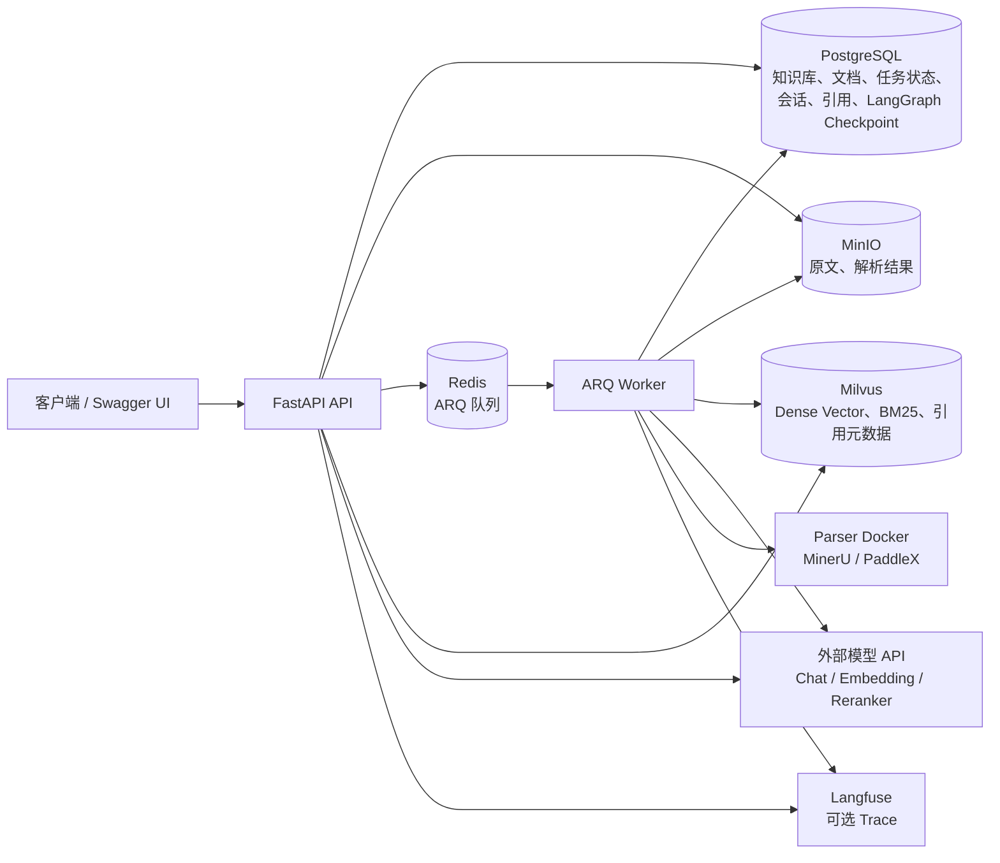

# RAG Agent

## 前端

前端需要 Docker Desktop（或兼容的 Docker Engine）、Docker Compose v2，以及本地开发所需的 Node.js 24 LTS 与 pnpm。首次运行可从示例配置创建本地 `.env`；不要提交真实凭据。

使用 Docker Compose 构建并启动前端及其依赖：

```powershell
docker compose up -d --build frontend
```

默认通过 `http://127.0.0.1:5173` 访问前端。浏览器只请求同源 `/api/v1`，由前端 Nginx 代理到 Compose 内的 `api:8000`；SSE 响应不会被代理缓冲。刷新 `/chat` 等前端深链时，Nginx 会回退到 `index.html`。

本地开发前端：

```powershell
Set-Location frontend
pnpm install --frozen-lockfile
pnpm dev
```

开发服务器默认把 `/api/v1` 代理到 `http://127.0.0.1:8000`，可通过 `VITE_API_PROXY_TARGET` 覆盖。完整前端检查命令：

```powershell
pnpm test:run
pnpm typecheck
pnpm build
```

PDF 图片处理链路见 [docs/pdf-image-processing.md](docs/pdf-image-processing.md)。

RAG Agent 是一个用于学习和验证 Agentic RAG 核心链路的后端项目。当前实现以 FastAPI 提供 API，以 ARQ Worker 异步摄取文档，并使用 PostgreSQL 保存业务状态与 LangGraph checkpoint、MinIO 保存原文和结构化解析结果、Redis 承载 ARQ 队列、Milvus 保存生产级文档分块索引。模型能力通过 OpenAI-compatible API 接入；Milvus、MinerU、PaddleX 按 Docker 服务配置。

## 已实现能力

- 知识库的创建、查询、列表与删除。
- `.md`、`.txt` 和 `.pdf` 文件上传，以及异步解析、分块、向量化和索引。
- PDF 可显式选择 `mineru` 或 `paddlex` 解析器；解析结果统一归一化为 `ParsedDocument`，保留页码、标题、段落、块序号和解析器元数据。
- 摄取任务状态与进度查询，失败任务重试。
- 文档列表、详情、原文下载、解析结果下载与一致性删除。
- Milvus Dense + BM25 双路召回、RRF 融合、去重与远程 Reranker API。
- `/rag/query` 通过混合检索返回稳定 `[S1]` 引用。
- `/rag/agent/query` 通过 LangGraph Agent 自主判断是否检索、改写检索词、最多三次调用检索工具，并用真实 Chat API 生成带引用回答。
- 持久化会话、用户消息、助手消息和引用快照；`/conversations/{id}/messages/stream` 通过 SSE 输出 Agent 回答过程。
- PostgreSQL LangGraph Checkpointer 启动时自动初始化，Agent 请求使用独立 thread checkpoint。
- 结构化 JSON 日志、`x-trace-id` 请求透传、Worker/摄取/检索/Agent/SSE 阶段日志，以及可选 Langfuse Trace。
- `app/evaluation` 与 `scripts/run_evaluation.py` 支持 Dense、BM25、RRF、Rerank 的 Recall@K、MRR 和引用命中率评估报告。
- `scripts/run_benchmarks.py` 支持 NanoSciFact 检索、HotpotQA Agentic RAG、ChartQA 图片/PDF 处理的真实模型评测，详见 [`docs/real-benchmark-datasets.md`](docs/real-benchmark-datasets.md)。
- 生产模式可通过 OpenAI-compatible Embedding API 写入真实向量；本地开发未配置 key 时保留 Hashing Embedding，避免默认测试消耗外部额度。
- 数据库迁移，以及单元、集成和端到端测试。

## 项目架构



长期运行的服务包括 `api`、`worker`、`postgres`、`redis`、`minio`、`milvus-etcd`、`milvus-minio` 和 `milvus-standalone`。`minio-init` 是一次性初始化服务，负责创建业务对象存储桶。

### 异步摄取数据流

1. 客户端通过 multipart 请求上传文档。
2. API 校验文件，将原文写入 MinIO，并在 PostgreSQL 创建文档和摄取任务记录。
3. API 将任务写入 Redis ARQ 队列并返回 `202 Accepted`，响应包含文档 ID 和任务 ID。
4. Worker 领取任务，从 MinIO 读取原文；Markdown/TXT 走本地解析器，PDF 按上传参数或默认配置调用 MinerU/PaddleX。
5. Worker 将统一 `ParsedDocument` 写回 MinIO、将带页码/章节/parser 元数据的文档分块写入 Milvus，并在 PostgreSQL 更新任务阶段、进度和最终状态。
6. 客户端通过摄取任务接口查询 `pending`、`processing`、`completed` 或 `failed` 状态。
7. 删除或重试文档时，系统先按知识库和文档 ID 清理 Milvus chunk，再清理对象存储和数据库状态。

### 混合检索数据流

1. `/rag/query` 先确认知识库存在。
2. API 调用 OpenAI-compatible Embedding API 获取查询向量。
3. Milvus 在同一知识库过滤条件下执行 dense vector 搜索和 BM25 sparse 搜索。
4. 服务使用 RRF 融合两路候选并按 chunk ID 去重。
5. 候选发送到远程 Reranker API，返回最终排序。
6. API 返回答案占位文本和带文档 ID、chunk ID、文件名、字符范围、score 的引用列表。

### Agent 查询数据流

1. `/rag/agent/query` 先确认知识库存在。
2. Agent 通过 OpenAI-compatible Chat API 判断问题是否需要检索；无需检索的问题直接生成回答。
3. 需要检索时，Agent 先将用户问题改写成更适合召回的查询词。
4. Agent 调用混合检索工具；工具复用 Milvus dense + BM25、RRF、Reranker 链路。
5. Agent 评估证据是否足够；若仍不足，最多再检索，总检索次数硬性限制为 3 次。
6. Agent 使用真实 Chat API 基于证据生成最终回答，并返回 `[S1]` 等引用来源。
7. LangGraph checkpoint 写入 PostgreSQL，用于后续会话恢复和流式事件阶段扩展。

### 会话与 SSE 数据流

1. 客户端在指定知识库下创建 conversation。
2. 客户端向 `/conversations/{conversation_id}/messages/stream` 发送用户消息。
3. API 保存 user message，并通过 `StreamingResponse` 输出 `text/event-stream`。
4. SSE 事件使用固定事件名：`message_start`、`agent_status`、`retrieval_start`、`retrieval_result`、`token`、`citation`、`message_end`、`error`。
5. Agent 完成回答后，assistant message 与本轮返回的 citations 在同一个 PostgreSQL 事务中提交。
6. Citation 保存 document ID、chunk ID、source label、quote、score 和 metadata 快照，避免刷新后引用丢失或漂移。

## 环境要求

- Docker Desktop 或兼容的 Docker Engine
- Docker Compose v2
- PowerShell 7 或 Windows PowerShell 5.1

首次部署时从仓库示例生成本地配置：

```powershell
Copy-Item .env.example .env
```

`.env` 包含应用名称、API 前缀、PostgreSQL、Redis、MinIO、Milvus 连接参数、外部 Chat/Embedding/Reranker API 参数，以及宿主机暴露端口。Compose 内部服务名已写入示例配置；本地开发可按需修改密码和端口。不要提交包含真实凭据的 `.env`。

关键外部服务变量：

| 变量 | 用途 |
| --- | --- |
| `RAG_AGENT_MILVUS_URI` | API/worker 访问 Milvus 的地址，Compose 内默认 `http://milvus-standalone:19530` |
| `RAG_AGENT_MILVUS_COLLECTION` | 文档分块 Collection 名称 |
| `RAG_AGENT_OPENAI_BASE_URL` | OpenAI-compatible Embedding API Base URL |
| `RAG_AGENT_OPENAI_API_KEY` | Embedding API Key |
| `RAG_AGENT_EMBEDDING_MODEL` | Embedding 模型名 |
| `RAG_AGENT_EMBEDDING_DIMENSION` | Milvus dense vector 维度，必须与模型输出一致 |
| `RAG_AGENT_RERANK_BASE_URL` | Reranker API Base URL；客户端会请求 `{base}/rerank` |
| `RAG_AGENT_RERANK_API_KEY` | Reranker API Key |
| `RAG_AGENT_RERANK_MODEL` | Reranker 模型名 |
| `RAG_AGENT_CHAT_BASE_URL` | OpenAI-compatible Chat API Base URL；未单独设置时可由 `RAG_AGENT_OPENAI_BASE_URL` 兜底 |
| `RAG_AGENT_CHAT_API_KEY` | Chat API Key；未单独设置时可由 `RAG_AGENT_OPENAI_API_KEY` 兜底 |
| `RAG_AGENT_CHAT_MODEL` | Agent 生成、分类、改写和证据判断使用的 Chat 模型名 |
| `RAG_AGENT_AGENT_MAX_RETRIEVALS` | Agent 单次回答最多调用检索工具的次数，默认 `3` |
| `RAG_AGENT_LANGGRAPH_STRICT_MSGPACK` | LangGraph checkpoint 序列化安全开关，默认 `true` |
| `RAG_AGENT_MINERU_BASE_URL` | Worker 访问 MinerU 解析服务的地址，Compose 内默认 `http://mineru:8000` |
| `RAG_AGENT_PADDLEX_BASE_URL` | Worker 访问 PaddleX 解析服务的地址，Compose 内默认 `http://paddlex:8080` |
| `RAG_AGENT_DEFAULT_PDF_PARSER` | PDF 未显式传 `parser` 时使用的解析器，可选 `mineru` 或 `paddlex` |
| `RAG_AGENT_LANGFUSE_BASE_URL` | Langfuse 服务地址；为空时 Trace 导出关闭 |
| `RAG_AGENT_LANGFUSE_PUBLIC_KEY` | Langfuse public key |
| `RAG_AGENT_LANGFUSE_SECRET_KEY` | Langfuse secret key |
| `RAG_AGENT_LANGFUSE_ENVIRONMENT` | Langfuse 环境名，默认 `default` |

默认入口：

| 服务 | 地址 |
| --- | --- |
| API | `http://127.0.0.1:8000` |
| Swagger UI | `http://127.0.0.1:8000/docs` |
| MinIO API | `http://127.0.0.1:9000` |
| MinIO Console | `http://127.0.0.1:9001` |
| Milvus gRPC/HTTP | `127.0.0.1:19530` |
| Milvus health/Web | `http://127.0.0.1:9091/healthz` |
| MinerU API（parser profile） | `http://127.0.0.1:18002` |
| PaddleX API（parser profile） | `http://127.0.0.1:18003` |

## Docker Compose 部署

在仓库根目录执行以下命令。

检查 Compose 配置并构建镜像：

```powershell
docker compose config --quiet
docker compose build api worker
```

启动完整服务栈：

```powershell
docker compose up -d
```

如需在本机同时启动 PDF 解析服务：

```powershell
docker compose --profile parser up -d mineru paddlex
```

`mineru` 和 `paddlex` 镜像默认分别读取 `RAG_AGENT_MINERU_IMAGE`、`RAG_AGENT_PADDLEX_IMAGE`；请按你的 GPU/CPU 环境提前准备可运行镜像。若不启动 parser profile，Markdown/TXT 摄取不受影响，但 PDF 解析会在调用对应服务时返回真实连接错误。

应用数据库迁移：

```powershell
docker compose exec api uv run --no-sync alembic upgrade head
```

检查容器与健康状态，并验证 API 存活：

```powershell
docker compose ps --all
Invoke-RestMethod http://127.0.0.1:8000/api/v1/health/live
```

`api`、`worker`、`postgres`、`redis`、`minio`、`milvus-etcd`、`milvus-minio` 和 `milvus-standalone` 应处于 `running` 或 `healthy` 状态，`minio-init` 应成功退出。

查看日志：

```powershell
docker compose logs --tail 100 api worker
docker compose logs -f worker
```

停止服务但保留数据卷：

```powershell
docker compose down
```

## API

启动后可访问 [Swagger UI](http://127.0.0.1:8000/docs) 或 [OpenAPI JSON](http://127.0.0.1:8000/openapi.json)。默认 API 前缀为 `/api/v1`。

| 方法 | 路径 | 用途 |
| --- | --- | --- |
| `GET` | `/health/live` | 存活检查 |
| `POST` / `GET` | `/knowledge-bases` | 创建 / 列出知识库 |
| `GET` / `DELETE` | `/knowledge-bases/{knowledge_base_id}` | 查询 / 删除知识库 |
| `POST` / `GET` | `/knowledge-bases/{knowledge_base_id}/conversations` | 创建 / 列出会话 |
| `GET` / `DELETE` | `/conversations/{conversation_id}` | 查询 / 删除会话 |
| `GET` | `/conversations/{conversation_id}/messages` | 查询会话消息和引用快照 |
| `POST` | `/conversations/{conversation_id}/messages/stream` | SSE 流式发送用户消息并持久化助手回答与引用 |
| `POST` / `GET` | `/knowledge-bases/{knowledge_base_id}/documents` | 异步上传 / 列出文档 |
| `GET` / `DELETE` | `/knowledge-bases/{knowledge_base_id}/documents/{document_id}` | 查询 / 删除文档 |
| `GET` | `/knowledge-bases/{knowledge_base_id}/documents/{document_id}/source` | 下载原文 |
| `GET` | `/knowledge-bases/{knowledge_base_id}/documents/{document_id}/parsed` | 下载解析结果 |
| `POST` | `/knowledge-bases/{knowledge_base_id}/documents/{document_id}/retry` | 重试失败摄取 |
| `GET` | `/ingestion-tasks/{task_id}` | 查询摄取任务状态与进度 |
| `POST` | `/rag/documents` | 同步摄取文本到进程内示例索引 |
| `POST` | `/rag/agent/query` | LangGraph Agent 查询：自主检索、生成回答并返回引用 |
| `POST` | `/rag/query` | 查询 Milvus 混合检索索引并返回引用 |

上传文档时可使用 multipart 字段 `parser` 指定解析器：

- `.md`、`.txt`：省略或传 `local`。
- `.pdf`：传 `mineru` 或 `paddlex`；省略时使用 `RAG_AGENT_DEFAULT_PDF_PARSER`。
- 解析器失败时不会静默降级，任务会进入 `failed`，错误保存在任务和文档记录中。

## 可观测性

- API 会读取请求头 `x-trace-id`，没有则自动生成，并在响应头返回。
- JSON 日志包含 `trace_id`、`stage`、`knowledge_base_id`、`document_id`、`task_id`、`conversation_id`、`message_id`、`parser`、`retrieval_attempt` 等上下文字段。
- 配置完整 Langfuse 变量后，摄取解析/分块/向量化/索引、混合检索、重排、Agent、SSE 会话流会写入 span；未配置时自动关闭。

## RAG 评估

评估数据集支持 JSON/YAML，最小结构如下：

```json
{
  "knowledge_base_id": "00000000-0000-0000-0000-000000000001",
  "questions": [
    {
      "id": "q1",
      "question": "问题文本",
      "expected_document_ids": ["00000000-0000-0000-0000-000000000002"],
      "expected_citations": [
        {"document_id": "00000000-0000-0000-0000-000000000002", "chunk_id": "0"}
      ]
    }
  ]
}
```

运行评估并生成 Markdown 报告：

```powershell
docker compose exec api uv run --no-sync python scripts/run_evaluation.py `
  --dataset path/to/dataset.json `
  --output reports/rag-evaluation.md `
  --knowledge-base-id 00000000-0000-0000-0000-000000000001 `
  --limit 5
```

## 交付文档

- `docs/architecture.md`：系统架构、关键链路和一致性原则。
- `docs/source-code-guide.md`：源码分层导读。
- `docs/rag-evaluation.md`：评估数据集、指标和报告解释。
- `docs/yuxi-comparison.md`：与常见项目/目标项目的能力对照。
- `docs/interview-guide.md`：一分钟/五分钟项目介绍与高频追问。

## 质量检查

服务栈健康且迁移完成后，在仓库根目录执行：

```powershell
docker compose config --quiet
docker compose exec api uv run --no-sync alembic upgrade head
docker compose exec -e RAG_AGENT_POSTGRES_DB=rag_agent_test api uv run --no-sync alembic upgrade head
docker compose exec api uv run --no-sync ruff format --check .
docker compose exec api uv run --no-sync ruff check .
docker compose exec api uv run --no-sync pyright
docker compose exec api uv run --no-sync pytest tests/unit -v
docker compose exec api uv run --no-sync pytest tests/integration -v
docker compose exec api uv run --no-sync pytest tests/e2e -v
```

真实外部 API 验证默认关闭，避免误消耗额度。配置好真实 Chat、Embedding、Reranker、MinerU、PaddleX、Langfuse 等服务后再显式运行：

```powershell
docker compose exec api uv run --no-sync pytest -m external -v
```

## 当前限制

- 单文件最大 5 MiB；Markdown/TXT 按 UTF-8 解析，PDF 依赖 MinerU/PaddleX 服务可用性。
- 未配置真实外部 API key 时，本地开发/测试路径不会调用付费模型服务；生产部署应设置 `RAG_AGENT_APP_ENV=production` 并配置真实 Chat/Embedding/Reranker/Langfuse 凭据。
- MinerU/PaddleX 的 Docker 镜像需要按目标机器的 CPU/GPU 与模型目录提前准备；Compose 只提供标准服务编排入口。
- `/rag/documents` 保留为早期阶段的同步演示入口；生产文档摄取应使用 `/knowledge-bases/{knowledge_base_id}/documents`。
- Compose 配置面向本地开发，包含源码挂载、热重载和默认开发凭据；生产部署需要独立的密钥、网络、备份、TLS、限流与可观测性配置。
