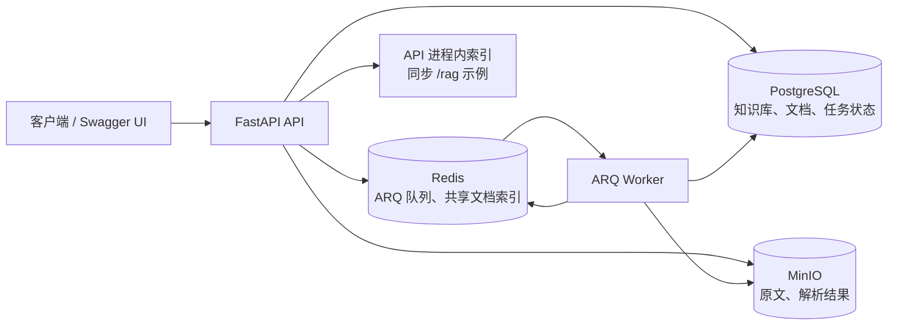

# RAG Agent

RAG Agent 是一个用于学习和验证 Agentic RAG 核心链路的后端项目。当前实现以 FastAPI 提供 API，以 ARQ Worker 异步摄取文档，并使用 PostgreSQL 保存业务状态、MinIO 保存原文和解析结果、Redis 承载任务队列与共享文档索引。

## 已实现能力

- 知识库的创建、查询、列表与删除。
- `.md`、`.txt` 文件上传，以及异步解析、分块、向量化和索引。
- 摄取任务状态与进度查询，失败任务重试。
- 文档列表、详情、原文下载、解析结果下载与一致性删除。
- 基于确定性 Hashing Embedding 的本地检索示例。
- 数据库迁移，以及单元、集成和端到端测试。

## 项目架构



长期运行的服务包括 `api`、`worker`、`postgres`、`redis` 和 `minio`。`minio-init` 是一次性初始化服务，负责创建对象存储桶。

### 异步摄取数据流

1. 客户端通过 multipart 请求上传文档。
2. API 校验文件，将原文写入 MinIO，并在 PostgreSQL 创建文档和摄取任务记录。
3. API 将任务写入 Redis ARQ 队列并返回 `202 Accepted`，响应包含文档 ID 和任务 ID。
4. Worker 领取任务，从 MinIO 读取 UTF-8 原文，依次执行解析、分块、Hashing Embedding 和索引。
5. Worker 将解析结果写回 MinIO、将文档分块索引写入 Redis，并在 PostgreSQL 更新任务阶段、进度和最终状态。
6. 客户端通过摄取任务接口查询 `pending`、`processing`、`completed` 或 `failed` 状态。

## 环境要求

- Docker Desktop 或兼容的 Docker Engine
- Docker Compose v2
- PowerShell 7 或 Windows PowerShell 5.1

首次部署时从仓库示例生成本地配置：

```powershell
Copy-Item .env.example .env
```

`.env` 包含应用名称、API 前缀、PostgreSQL、Redis、MinIO 连接参数，以及宿主机暴露端口。Compose 内部服务名已写入示例配置；本地开发可按需修改密码和端口。不要提交包含真实凭据的 `.env`。

默认入口：

| 服务 | 地址 |
| --- | --- |
| API | `http://127.0.0.1:8000` |
| Swagger UI | `http://127.0.0.1:8000/docs` |
| MinIO API | `http://127.0.0.1:9000` |
| MinIO Console | `http://127.0.0.1:9001` |

## Docker Compose 部署

在仓库根目录执行以下命令。

检查 Compose 配置并构建镜像：

```powershell
docker compose config --quiet
docker compose build api worker
```

启动完整服务栈：

```powershell
docker compose up -d
```

应用数据库迁移：

```powershell
docker compose exec api uv run --no-sync alembic upgrade head
```

检查容器与健康状态，并验证 API 存活：

```powershell
docker compose ps --all
Invoke-RestMethod http://127.0.0.1:8000/api/v1/health/live
```

`api`、`worker`、`postgres`、`redis` 和 `minio` 应处于 `running` 或 `healthy` 状态，`minio-init` 应成功退出。

查看日志：

```powershell
docker compose logs --tail 100 api worker
docker compose logs -f worker
```

停止服务但保留数据卷：

```powershell
docker compose down
```

## API

启动后可访问 [Swagger UI](http://127.0.0.1:8000/docs) 或 [OpenAPI JSON](http://127.0.0.1:8000/openapi.json)。默认 API 前缀为 `/api/v1`。

| 方法 | 路径 | 用途 |
| --- | --- | --- |
| `GET` | `/health/live` | 存活检查 |
| `POST` / `GET` | `/knowledge-bases` | 创建 / 列出知识库 |
| `GET` / `DELETE` | `/knowledge-bases/{knowledge_base_id}` | 查询 / 删除知识库 |
| `POST` / `GET` | `/knowledge-bases/{knowledge_base_id}/documents` | 异步上传 / 列出文档 |
| `GET` / `DELETE` | `/knowledge-bases/{knowledge_base_id}/documents/{document_id}` | 查询 / 删除文档 |
| `GET` | `/knowledge-bases/{knowledge_base_id}/documents/{document_id}/source` | 下载原文 |
| `GET` | `/knowledge-bases/{knowledge_base_id}/documents/{document_id}/parsed` | 下载解析结果 |
| `POST` | `/knowledge-bases/{knowledge_base_id}/documents/{document_id}/retry` | 重试失败摄取 |
| `GET` | `/ingestion-tasks/{task_id}` | 查询摄取任务状态与进度 |
| `POST` | `/rag/documents` | 同步摄取文本到进程内示例索引 |
| `POST` | `/rag/query` | 查询进程内示例索引 |

## 质量检查

服务栈健康且迁移完成后，在仓库根目录执行：

```powershell
docker compose exec api uv run --no-sync ruff format --check app tests
docker compose exec api uv run --no-sync ruff check .
docker compose exec api uv run --no-sync pyright
docker compose exec api uv run --no-sync pytest tests/unit -v
docker compose exec api uv run --no-sync pytest tests/integration -v
docker compose exec api uv run --no-sync pytest tests/e2e -v
```

## 当前限制

- 文件上传仅支持非空 `.md` 和 `.txt`，单文件最大 5 MiB；Worker 按 UTF-8 解码原文。
- 当前使用确定性的 Hashing Embedding，不包含外部大模型、生成式回答或语义级 Embedding。
- 异步摄取生成的共享文档索引存储在 Redis；`/rag/query` 仍只查询 API 进程内的同步示例索引，两者尚未接通。
- Redis 文档索引不是专用向量数据库，不提供持久化向量检索能力。
- Compose 配置面向本地开发，包含源码挂载、热重载和默认开发凭据；生产部署需要独立的密钥、网络、备份、TLS 与可观测性配置。
