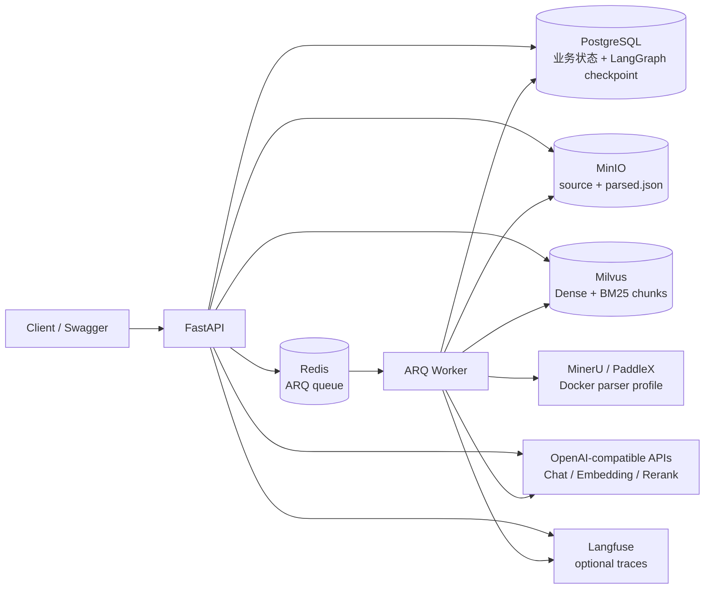

# RAG Agent 架构说明

## 总览

RAG Agent 是一个生产化 Agentic RAG 后端样板。主链路由 FastAPI、ARQ Worker、PostgreSQL、Redis、MinIO、Milvus、外部模型 API、MinerU/PaddleX 和可选 Langfuse 组成。

## 关键链路

1. 文档上传：API 校验文件，写入 MinIO，创建 document 与 ingestion task，然后投递 ARQ job。
2. 异步摄取：Worker claim task，读取原文，调用本地或外部 parser，生成 `ParsedDocument`，分块、向量化并写入 Milvus。
3. 混合检索：查询向量化后同时执行 Dense 和 BM25，使用 RRF 融合，再调用 Reranker。
4. Agent：LangGraph 判断是否检索、改写查询、调用检索工具、判断证据、生成引用回答。
5. 会话与 SSE：用户消息先落库，SSE 输出过程事件，最终 assistant message 与 citation 快照同事务提交。
6. 可观测性：HTTP/Worker trace context 贯穿关键阶段；配置完整时导出 Langfuse span。

## 数据一致性原则

- 数据库记录是业务事实，外部对象和索引清理失败时保留可诊断状态。
- 删除先清理 Milvus/MinIO，再删除数据库记录，避免孤儿资源失去定位依据。
- 摄取任务通过数据库 claim 保证重复投递时幂等。
- 引用以快照形式落库，避免索引重建后历史回答失去证据。

