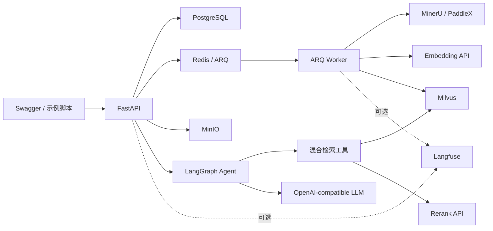

# RAG-Agent 学习型项目设计

日期：2026-07-17

## 1. 背景与目标

在 Yuxi 仓库下新建独立后端项目 `RAG-Agent/`。项目不直接依赖 `backend/package/yuxi`，而是在理解 Yuxi 核心实现后重新设计和实现一套更小、更清晰的 Agentic RAG 系统。

该项目同时承担两个目标：

1. 完成一套可运行、可测试、可评估的 RAG Agent 后端。
2. 让学习者能够独立解释核心代码、数据流、架构取舍、失败路径和测试方法，并将真实成果用于求职。

实现方式采用“教学驱动开发”：学习者负责主要编码，指导者负责拆解任务、讲解原理、提供分级提示和参考代码、审查实现并组织验收。项目不采用一次性代写方式交付。

## 2. 已确认的产品边界

### 2.1 核心能力

- 单用户、本地运行，不实现登录、角色、权限和多租户。
- 支持多个知识库，每次会话固定绑定一个知识库。
- 支持 PDF、Markdown 和 TXT；PDF 上传时明确选择 MinerU 或 PaddleX，默认 MinerU。
- 使用 MinIO 保存原始文件和结构化解析结果。
- 使用 PostgreSQL 保存业务元数据、任务、会话、消息和引用，并承载 LangGraph Checkpointer。
- 使用 Redis 与 ARQ 异步执行解析、分块、Embedding 和索引任务。
- 使用 Milvus 保存 chunk、稠密向量与 BM25 稀疏检索字段。
- 使用 Dense + BM25 双路召回、RRF 融合、候选去重和远程 Reranker 重排。
- 使用最小 LangGraph 状态图实现自主检索 Agent；Agent 可不检索、检索或改写查询后再次检索，最多检索三次。
- 支持多轮会话持久化、SSE 流式回答和精确引用。
- LLM 与 Embedding 统一使用 OpenAI-compatible API；Reranker 使用独立兼容 API。
- 使用结构化日志，可选接入 Langfuse；未配置 Langfuse 时主链路正常运行。
- 提供轻量离线评估，比较 Dense、BM25、RRF 和 Rerank 各阶段效果。

### 2.2 明确不做

- 前端。
- MCP、Skills、SubAgent、Sandbox 和知识图谱。
- 多知识库联合检索。
- 文档版本管理和增量更新。
- 自动解析器降级或静默回退。
- 完整在线评估平台。
- 为尚未出现的需求预设插件体系。

## 3. 总体架构

采用“模块化单体 API + 独立异步 Worker”架构：



模块边界：

- `api`：请求解析、依赖注入和响应装配。
- `services`：串联完整业务用例。
- `repositories`：封装 PostgreSQL 持久化。
- `rag`：分块、索引、混合召回、融合、重排和引用。
- `agent`：LangGraph 状态、工具和最小循环。
- `parsers`：统一不同文件格式和外部解析服务输出。
- `infrastructure`：封装 Milvus、MinIO、Redis 和 Langfuse 客户端。

不为简单线性逻辑制造细碎 helper 或多层抽象。拆分必须服务于复用、隔离副作用或降低认知负担。

## 4. 核心数据模型

PostgreSQL 包含：

- `knowledge_bases`：名称、说明、固定的 Embedding 模型与维度。
- `documents`：所属知识库、文件信息、解析器、MinIO key、状态、chunk 数量和错误。
- `ingestion_tasks`：ARQ job、状态、当前阶段、进度、错误和时间。
- `conversations`：所属知识库、标题和时间。
- `messages`：会话中的用户与最终 Agent 消息。
- `message_citations`：引用的文档、chunk、页码、章节、行区间、原文快照和评分。

文档状态：

```text
pending → processing → completed
                     ↘ failed
failed → pending
```

Milvus 中保存 chunk 正文、知识库与文档标识、稠密向量、BM25 字段和引用元数据。PostgreSQL 不重复保存完整 chunk 正文。MinIO 保存原文件和结构化解析结果。

## 5. 文档摄取链路

1. API 校验知识库、格式和解析器。
2. 原文件写入 MinIO。
3. PostgreSQL 创建文档和任务记录。
4. ARQ 入队并返回 `202 Accepted`。
5. Worker 调用选定解析器，生成统一 `ParsedDocument`。
6. 解析结果写回 MinIO。
7. 按 PDF 页与段落、Markdown 标题层级或 TXT 段落进行结构化递归分块。
8. 批量调用 Embedding API。
9. 批量写入 Milvus。
10. 全部写入成功后将文档和任务标记为完成。

失败时记录准确阶段，不自动切换解析器或检索策略。重试前按 `document_id` 清理残留向量，并创建新的任务记录。

跨存储操作不伪装为数据库事务。每个失败点提供明确补偿：数据库创建失败时删除刚上传对象；入队失败时保留文件并标记失败；删除清理失败时保留业务记录并允许重试，不返回虚假成功。

## 6. 混合检索与 Agent

检索链路：

```text
查询规范化
→ Dense 与 BM25 双路召回
→ RRF 融合
→ chunk 去重和相邻重叠去重
→ 远程 Reranker
→ Top-K 结构化证据
```

RRF 只融合排名，不直接混合不可比的原始分数。检索结果保留 dense rank、sparse rank、RRF score 和 rerank score，支持调试与评估。

Agent 采用最小 ReAct 风格状态图。查询改写由 Agent 完成，检索器内部不隐藏 LLM 调用。最终回答使用 `[S1]` 等稳定标识引用本轮实际证据；不存在的引用视为错误，不猜测修复。最终消息与引用在同一 PostgreSQL 事务中保存。

SSE 事件限定为：`message_start`、`agent_status`、`retrieval_start`、`retrieval_result`、`token`、`citation`、`message_end` 和 `error`。

## 7. API 范围

API 前缀为 `/api/v1`，包含：

- 知识库：创建、列表、详情和删除。
- 文档：上传、列表、详情、删除、失败重试、下载和解析结果查看。
- 任务：按 ID 查询状态。
- 会话：创建、列表、详情、删除和消息列表。
- 对话：SSE 流式发送消息。
- 健康检查：`live` 与 `ready`。

非空知识库禁止直接删除。任务首版不实现列表、取消或任务 SSE。

## 8. 测试、评估与质量门槛

- 单元测试覆盖解析结果转换、分块、RRF、去重、引用校验、Agent 循环上限和状态转换。
- 集成测试使用真实 PostgreSQL、Redis、MinIO 和 Milvus，模型与解析服务使用确定性替身。
- E2E 覆盖上传、异步索引、创建会话、Agent 检索、SSE 回答与引用落库。
- 真实 MinerU、PaddleX 和外部模型测试使用 `external` 标记，显式配置后运行。
- 离线评估包含 Recall@K、MRR、引用命中率和 Judge 模型忠实度。
- Ruff 格式化与检查、Pyright 类型检查、Alembic 空库迁移和 Docker 内测试必须通过。

## 9. 文档交付

`RAG-Agent/docs/` 最终包含：

- `architecture.md`：架构、边界、数据流和不变量。
- `source-code-guide.md`：按执行链路逐文件、逐核心符号讲解。
- `yuxi-comparison.md`：Yuxi 原模块、对应实现、删减内容及原因。
- `rag-evaluation.md`：评估数据、指标、实验和调参。
- `interview-guide.md`：项目介绍、简历描述、难点、取舍和面试追问。
- `learning-roadmap.md`：阶段任务、验收标准和学习进度。

源码导读解释设计意图、输入输出、依赖、关键流程、替代方案、失败路径、测试与调试方法，不机械复制源码或对直观代码逐行复述。

## 10. 教学协作方式

每个任务按以下循环推进：

1. 讲解问题、原理、Yuxi 对应实现和验收标准。
2. 学习者独立实现功能和测试。
3. 指导者审查真实代码并提出按优先级排序的反馈。
4. 学习者修改并在 Docker 中验证。
5. 指导者进行实现细节和架构取舍追问。
6. 功能、测试和讲解均通过后进入下一任务。

帮助按“概念提示 → 签名和伪代码 → 局部参考代码 → 完整对照示例 → 必要时直接修改”逐级增加。核心代码尽量由学习者完成。

## 11. 总体验收标准

- [ ] `RAG-Agent/` 是独立且可通过 Docker Compose 启动的后端项目。
- [ ] PDF、Markdown、TXT 可异步解析、分块和索引。
- [ ] MinerU 与 PaddleX 可被明确选择且失败不静默回退。
- [ ] 多个知识库在存储与检索层正确隔离。
- [ ] Milvus 完成 Dense + BM25 + RRF + Rerank 检索。
- [ ] LangGraph Agent 可自主决定是否检索并进行受限的多轮检索。
- [ ] 对话支持持久化、Checkpointer 恢复、SSE 和精确引用。
- [ ] 删除与失败重试不会留下可检索的脏数据。
- [ ] 默认测试不依赖付费模型服务，真实外部链路可显式验证。
- [ ] 评估脚本可量化各检索阶段效果。
- [ ] 学习者能够独立解释核心实现和架构取舍。
- [ ] 求职材料只描述项目中真实完成并验证的能力。

## 12. 当前任务 Checklist

- [x] 完成需求访谈和技术边界确认。
- [x] 确认教学驱动而非一次性代写的协作方式。
- [x] 确认 8～12 周、每周 10～20 小时的节奏。
- [ ] 建立独立项目骨架和开发环境。
- [ ] 按学习路线逐阶段实现、测试和讲解。
- [ ] 完成最终评估、源码导读和求职材料。
