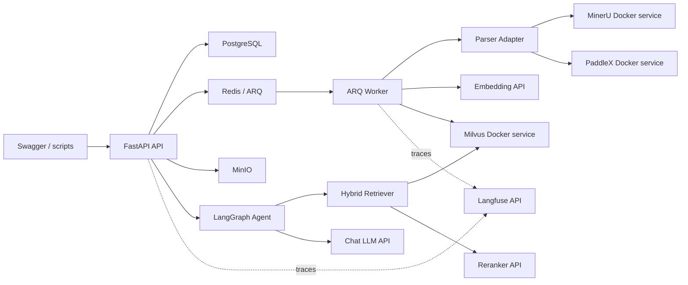

# Stages 4-9 Production Design

**Date:** 2026-08-09

**Status:** approved in conversation for design drafting; implementation starts only after this written spec is reviewed.

## Goal

Complete stages 4 through 9 as a production-oriented Agentic RAG backend, extending the completed Stage 3 async ingestion system with real Milvus hybrid retrieval, real parser services, real model APIs, LangGraph agent execution, persistent conversations, SSE, observability, evaluation, and final delivery documentation.

## Confirmed Scope

- Milvus runs as a real Docker Compose service.
- MinerU runs as a real Docker Compose parser service.
- PaddleX runs as a real Docker Compose parser service.
- Chat LLM, Embedding, Reranker, and Langfuse are reached through real HTTP APIs configured by environment variables.
- Markdown, TXT, and PDF ingestion share one parsed-document pipeline after Stage 7.
- Default local checks must avoid accidentally spending paid API quota; explicit external verification commands exercise real APIs.
- README, `.env.example`, Docker Compose, roadmap, and final delivery documents stay synchronized with the implemented stage.

## Non-Goals

- No frontend.
- No authentication, authorization, roles, or multi-tenant product surface.
- No multi-knowledge-base joint retrieval.
- No automatic parser fallback. The selected parser either succeeds or records its real failure.
- No hidden deterministic stand-in for the production path. Test doubles are allowed only in unit tests and marked test seams.
- No generic plugin system or speculative extension framework.

## Architecture

The system remains a modular FastAPI application plus ARQ worker. Stage 4 replaces the temporary Redis document index with Milvus as the durable retrieval store. Stage 5 adds a LangGraph agent that calls the hybrid retriever as a tool and uses a PostgreSQL checkpointer. Stage 6 persists conversations, messages, and citations, then streams agent execution over SSE. Stage 7 adds parser adapters for MinerU and PaddleX and upgrades all file formats to produce a shared `ParsedDocument` representation. Stage 8 hardens quality, tracing, and observability. Stage 9 adds evaluation and career-facing delivery documents.



## Configuration

New settings will live in `app/core/config.py` and `.env.example`. Runtime code must never hard-code credentials.

- `RAG_AGENT_MILVUS_URI`
- `RAG_AGENT_MILVUS_TOKEN`
- `RAG_AGENT_MILVUS_COLLECTION`
- `RAG_AGENT_OPENAI_BASE_URL`
- `RAG_AGENT_OPENAI_API_KEY`
- `RAG_AGENT_CHAT_MODEL`
- `RAG_AGENT_EMBEDDING_MODEL`
- `RAG_AGENT_EMBEDDING_DIMENSION`
- `RAG_AGENT_RERANK_BASE_URL`
- `RAG_AGENT_RERANK_API_KEY`
- `RAG_AGENT_RERANK_MODEL`
- `RAG_AGENT_MINERU_BASE_URL`
- `RAG_AGENT_PADDLEX_BASE_URL`
- `RAG_AGENT_DEFAULT_PDF_PARSER`
- `RAG_AGENT_LANGFUSE_BASE_URL`
- `RAG_AGENT_LANGFUSE_PUBLIC_KEY`
- `RAG_AGENT_LANGFUSE_SECRET_KEY`
- `RAG_AGENT_EXTERNAL_TESTS_ENABLED`

Names may be refined during planning only to match the existing config naming style. The meaning of each setting must stay stable.

## Stage 4 Design: Milvus Hybrid Retrieval

Stage 4 introduces Milvus as the source of retrievable chunks. The worker writes chunks to Milvus after parsing, chunking, and embedding. The API reads from Milvus through a retriever service instead of querying the Stage 2 process-local store.

The collection stores:

- `chunk_id`
- `knowledge_base_id`
- `document_id`
- `task_id`
- `chunk_index`
- `text`
- `source_uri`
- `metadata`
- dense embedding vector
- sparse or BM25 text field
- created timestamp

Knowledge base isolation is enforced by Milvus filter expressions on every insert, search, retry cleanup, and delete cleanup path. The retriever uses dense search plus BM25 sparse search, fuses ranks with RRF, removes duplicate chunks by stable chunk identity, optionally removes adjacent overlaps, then calls the real reranker API for final ordering.

The Stage 3 Redis document index becomes deprecated implementation detail and is removed from the production query path. Redis remains the ARQ broker.

## Stage 5 Design: LangGraph Agent

The agent is a bounded state graph with these conceptual nodes:

- classify whether retrieval is needed
- rewrite or normalize the query when needed
- call the hybrid retrieval tool
- decide whether more retrieval is needed
- generate the final answer from evidence

The graph may call retrieval at most three times. It records each retrieval attempt in state so tests can prove the loop cannot run forever. It uses a PostgreSQL checkpointer through the official LangGraph Postgres integration and calls checkpointer setup during application initialization or migration-oriented startup.

LLM calls go through an OpenAI-compatible chat client configured by `base_url`, API key, and model name. The retriever remains a normal service dependency so Agent behavior can be tested without invoking paid APIs in unit tests.

## Stage 6 Design: Conversations, SSE, and Citations

Stage 6 adds durable conversation data:

- `conversations`
- `messages`
- `message_citations`

The chat endpoint creates or appends to a conversation and streams events over SSE:

- `message_start`
- `agent_status`
- `retrieval_start`
- `retrieval_result`
- `token`
- `citation`
- `message_end`
- `error`

Final assistant messages and citations commit in one PostgreSQL transaction. Citations must refer to evidence returned in the same agent run. A hallucinated or stale citation is a validation error and must not be persisted.

Client disconnects stop streaming and leave a diagnostic message state. The design does not claim exactly-once streaming delivery; it guarantees durable final state only after transaction commit.

## Stage 7 Design: PDF Parsing and ParsedDocument

Stage 7 introduces a parser boundary:

```text
Uploaded file -> ParserAdapter -> ParsedDocument -> Chunker -> Embedding -> Milvus
```

`ParsedDocument` is the normalized representation for all supported formats. It contains document-level metadata and ordered blocks. Each block can carry:

- text
- page number
- heading path
- paragraph or block index
- OCR confidence when available
- parser name and parser version when provided
- source coordinates when provided by the parser

Markdown and TXT use local parser adapters. PDF uses the selected Docker parser service: `mineru` or `paddlex`. The upload API requires an explicit parser for PDF or uses a documented default from configuration. If MinerU fails, the task records MinerU's error. If PaddleX fails, the task records PaddleX's error. The system never silently switches parser.

MinIO stores both the original file and the structured parsed artifact.

## Stage 8 Design: Quality and Observability

Stage 8 turns the system into a diagnosable service. Logs include trace ID, knowledge base ID, document ID, task ID, conversation ID, message ID, parser, retrieval attempt, and stage. Errors preserve the failing boundary: API validation, object storage, parser, embedding API, Milvus, reranker API, chat API, database, queue, or SSE persistence.

Langfuse tracing is enabled when all required Langfuse settings are present. Missing Langfuse configuration disables trace export without breaking the request. The app records trace spans around ingestion, parser calls, embedding, Milvus insert/search, reranking, agent steps, chat completion, and SSE response.

Quality gates:

- `ruff format --check .`
- `ruff check .`
- `pyright`
- Alembic single-head check
- migration from empty database
- unit tests
- integration tests with Docker infrastructure
- E2E tests for upload, indexing, retrieval, agent answer, SSE, and citation persistence
- external tests for real paid or remote APIs only when explicitly enabled

## Stage 9 Design: Evaluation and Delivery

Stage 9 adds a reproducible evaluation package:

- dataset schema for questions, expected documents, expected citations, and optional expected answer facts
- ingestion fixture loader
- retrieval evaluation for Dense, BM25, RRF, and Rerank
- metrics: Recall@K, MRR, citation hit rate, and optional judge faithfulness score
- Markdown report generation

Final documents:

- `docs/architecture.md`
- `docs/source-code-guide.md`
- `docs/yuxi-comparison.md`
- `docs/rag-evaluation.md`
- `docs/interview-guide.md`
- updated `docs/learning-roadmap.md`
- updated `README.md`

Career-facing materials must describe only capabilities that are implemented and verified in this repository.

## Error Handling and Recovery

Cross-storage actions remain explicitly compensating rather than pretending to be one transaction.

- Upload failure before database commit deletes newly written objects when possible.
- Queue failure after database commit leaves a failed task and retained source object.
- Parser failure records the selected parser and raw error summary.
- Embedding API failure marks the task failed before Milvus write.
- Milvus partial write failure triggers document-level cleanup by `document_id` before marking failure when cleanup succeeds; otherwise records cleanup failure details.
- Retry creates a new task and removes old Milvus chunks before re-indexing.
- Delete removes MinIO objects and Milvus chunks before deleting database records.
- Citation persistence failure rolls back the assistant message and citations together.

## Testing Strategy

Unit tests exercise pure behavior and client contracts without calling paid or unstable services. Integration tests run against Docker PostgreSQL, Redis, MinIO, and Milvus. Parser integration tests run against Docker MinerU/PaddleX when their services are enabled. External tests call real Chat, Embedding, Reranker, and Langfuse APIs only when `RAG_AGENT_EXTERNAL_TESTS_ENABLED=true` and required credentials exist.

This keeps normal development predictable while still providing a real production verification path.

## Implementation Planning Sequence

Create one detailed implementation plan per stage:

1. `docs/plans/2026-08-09-stage-4-milvus-hybrid-retrieval.md`
2. `docs/plans/2026-08-09-stage-5-langgraph-agent.md`
3. `docs/plans/2026-08-09-stage-6-conversations-sse-citations.md`
4. `docs/plans/2026-08-09-stage-7-pdf-parsers.md`
5. `docs/plans/2026-08-09-stage-8-quality-observability.md`
6. `docs/plans/2026-08-09-stage-9-evaluation-delivery.md`

Each plan must contain task-sized TDD steps, target files, interfaces, verification commands, Docker acceptance, README updates, and roadmap updates.

## External References Consulted

- Milvus Docker Compose standalone documentation.
- Milvus BM25 Function documentation.
- Milvus hybrid search and RRF reranking documentation.
- LangGraph PostgreSQL checkpointer reference.
- Langfuse Python SDK and OpenAI integration documentation.
- MinerU Docker compose examples.
- PaddleX serving documentation.
